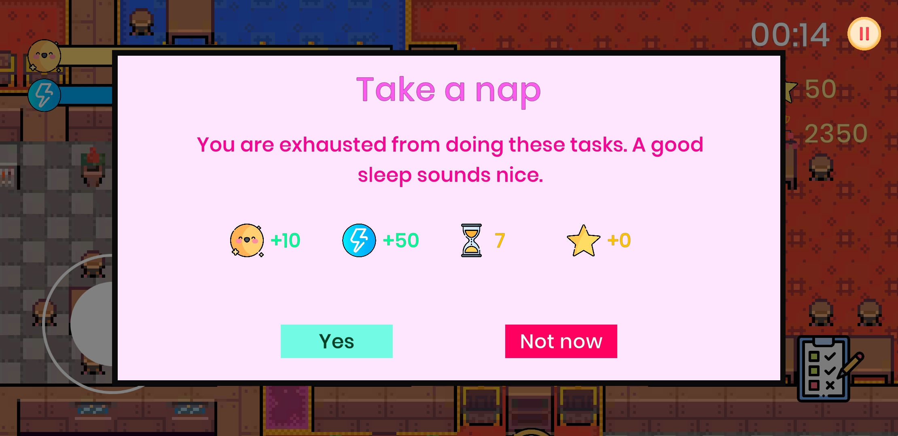
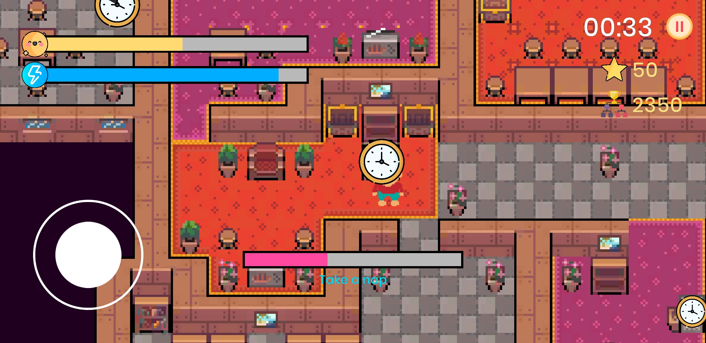

# Boredom Escape

This is the game that we made for Gameloft Game Jam 2020 in 48 hours

## Platform

Android

## Theme

Life at Home

## Team

RDC Circus

## Contributors

- Truong Duc Khai (khaitruong922)
- Vo Thanh Thong (vothanhthong)
- Pham Thanh Nam (AshtonPh)
- Bui Vu Thien An

## How to play?

Your happiness and energy will drain over time.

If your happiness reaches zero, you will lose.

The more energy you have, the faster you run.

Run around the house and finish task to maintain your happiness.

## Preview

[Gameplay Video](https://drive.google.com/file/d/1t9Oq6gok6RMx2kyvPcIqr5C2usO_ASEa/view?usp=sharing)
## Art sources

- Icon: www.flaticon.com
- Tilemap: https://tilation.itch.io/
- Character, Game Icon, Menu Background: Bui Vu Thien An
- Font: https://usemodify.com/

## Music & Sound sources

- Music by Eric Matyas www.soundimage.org
- Sound effect: https://mixkit.co/free-sound-effects/game/

## Installation 
Download the game [here](https://drive.google.com/file/d/1yBEw86uf8S9Je43AO-d-YoEpKDoWCYLW/view?usp=sharing)

